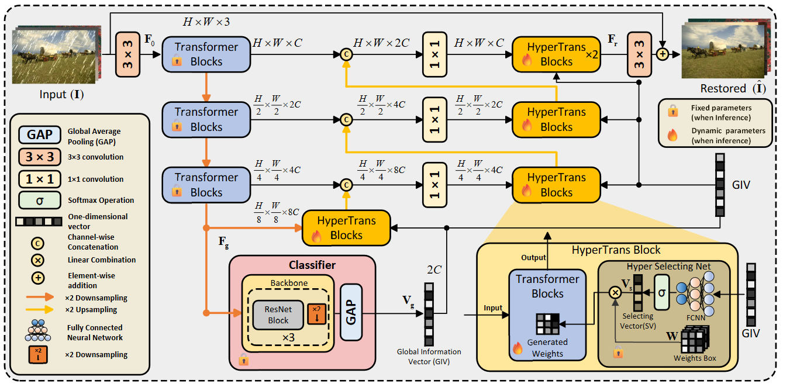
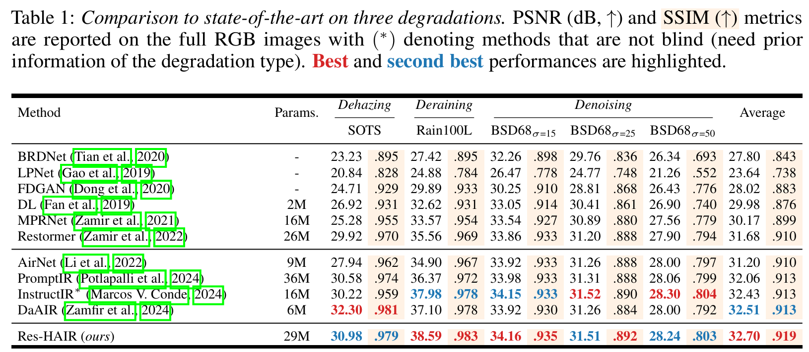
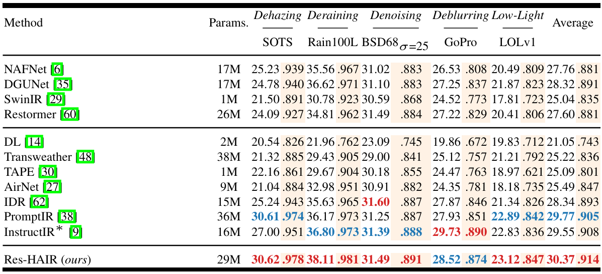
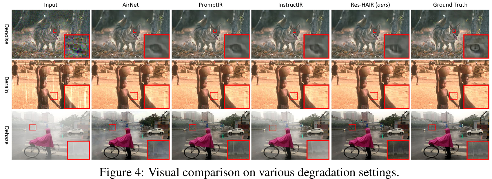

#  HAIR: Hypernetworks-based All-in-One Image Restoration

[](https://arxiv.org/abs/2408.08091)


<hr />

> **Abstract:** *Image restoration aims to recover a high-quality clean image from its degraded version. Recent progress in image restoration has demonstrated the effectiveness of All-in-One image restoration models in addressing various degradations simultaneously. However, these existing methods typically utilize the same parameters to tackle images with different degradation types, thus forcing the model to balance the performance between different tasks and limiting its performance on each task. To alleviate this issue, we propose HAIR, a \textbf{H}ypernetworks-based \textbf{A}ll-in-One \textbf{I}mage \textbf{R}estoration method that dynamically generates parameters based on input images. Specifically, HAIR consists of two main components, i.e., Classifier and Hyper Selecting Net (HSN). The Classifier is a simple image classification network used to generate a Global Information Vector (GIV) that contains the degradation information of the input image, and the HSN is a simple fully-connected neural network that receives the GIV and outputs parameters for the corresponding modules. Extensive experiments demonstrate that HAIR can significantly improve the performance of existing image restoration models in a plug-and-play manner, both in single-task and all-in-one settings. Notably, our innovative model, Res-HAIR, which integrates HAIR into the well-known Restormer, can obtain superior or comparable performance compared with current state-of-the-art methods. Moreover, we theoretically demonstrate that our proposed HAIR requires fewer parameters in contrast to the prevalent All-in-One methodologies.* 
<hr />

🔥 *New SOTA for all-in-one image restoration on a range of tasks, including Dehaze, Denoise, Derain, Deblur, Low-light Enhancement, etc.*
**Please give us a star ★ if you find this work interesting.**

## Network Architecture

 

## Update
- **2024.8.16**: Release raw codes without comments.

## Installation and Data Preparation

See [INSTALL.md](INSTALL.md) for the installation of dependencies and dataset preperation required to run this codebase. (Note that this repository is prepared for 3-degradation setting. For 5-degradation setting, please refer [IDR](https://github.com/JingHao99/IDR-Ingredients-oriented-Degradation-Reformulation).

## Training

After preparing the training data in ```data/``` directory, use 
```
python train.py
```
to start the training of the model. Use the ```de_type``` argument to choose the combination of degradation types to train on. By default it is set to all the 3 degradation types (noise, rain, and haze).

Example Usage: If we only want to train on deraining and dehazing:
```
python train.py --de_type derain dehaze
```

## Testing

After preparing the testing data in ```test/``` directory, place the mode checkpoint file in the ```ckpt``` directory. The pretrained model can be downloaded [here](https://drive.google.com/file/d/1Zr0gy8MPFI6q0rytGXuqyqLKrk8bBeQg/view?usp=sharing), alternatively, it is also available under the releases tab. To perform the evalaution use
```
python test.py --mode {n}
```
```n``` is a number that can be used to set the tasks to be evaluated on, 0 for denoising, 1 for deraining, 2 for dehaazing and 3 for all-in-one setting.

Example Usage: To test on all the degradation types at once, run:

```
python test.py --mode 3
```

## Demo
To obtain visual results from the model ```demo.py``` can be used. After placing the saved model file in ```ckpt``` directory, run:
```
python demo.py --test_path {path_to_degraded_images} --output_path {save_images_here}
```
Example usage to run inference on a directory of images:
```
python demo.py --test_path './test/demo/' --output_path './output/demo/'
```
Example usage to run inference on an image directly:
```
python demo.py --test_path './test/demo/image.png' --output_path './output/demo/'
```
To use tiling option while running ```demo.py``` set ```--tile``` option to ```True```. The Tile size and Tile overlap parameters can be adjusted using ```--tile_size``` and ```--tile_overlap``` options respectively.


## Results
Performance results of the PromptIR framework trained under the all-in-one setting

**Performance**

 

 

**Visual Results**
 

## Citation

If you use our work, please consider citing:

    @misc{cao2024hair,
          title={HAIR: Hypernetworks-based All-in-One Image Restoration}, 
          author={Jin Cao and Yi Cao and Li Pang and Deyu Meng and Xiangyong Cao},
          year={2024},
          eprint={2408.08091},
          archivePrefix={arXiv},
          primaryClass={cs.CV},
          url={https://arxiv.org/abs/2408.08091}, 
    }


## Contact

Should you have any questions, please contact 2213315515@stu.xjtu.edu.cn.

**Acknowledgment:** This repository is highly based on the [PromptIR](https://github.com/va1shn9v/PromptIR) repository, thanks for the great work. 
