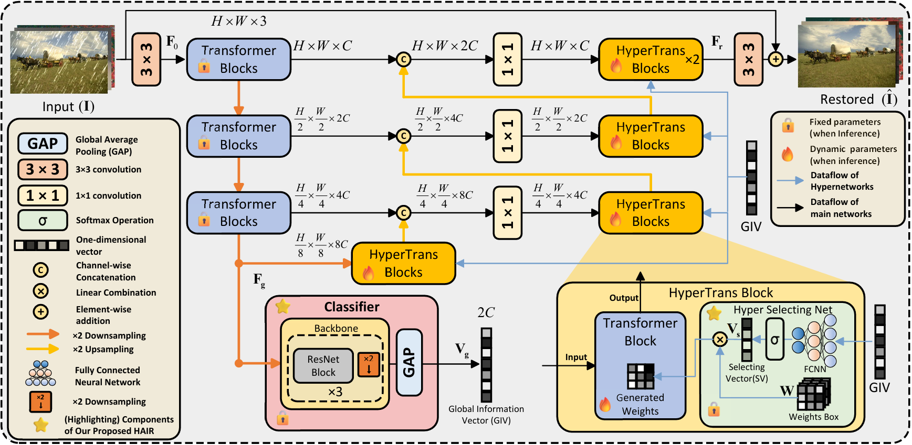
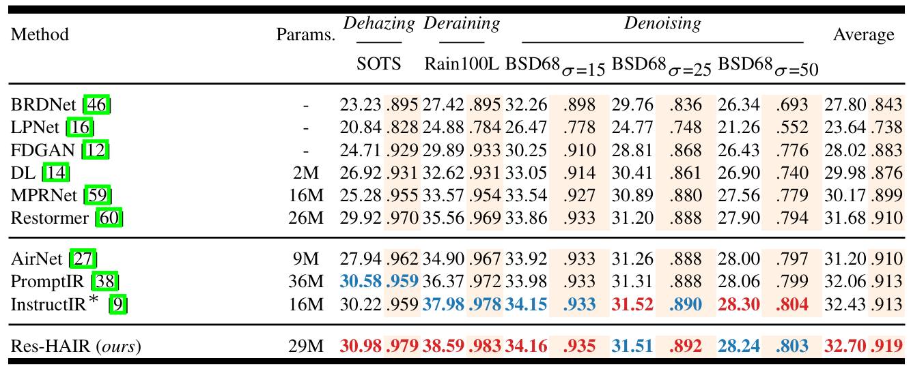

#  HAIR: Hypernetworks-based All-in-One Image Restoration

[](https://arxiv.org/abs/2306.13090)


<hr />

> **Abstract:** *Image restoration involves recovering a high-quality clean image from its degraded version, which is a fundamental task in computer vision. Recent progress in image restoration has demonstrated the effectiveness of learning models capable of addressing various degradations simultaneously, i.e., the All-in-One image restoration models. However, these existing methods typically utilize the same parameters facing images with different degradation types, which causes the model to be forced to trade off between degradation types, therefore impair the total performance. To solve this problem, we propose HAIR, a Hypernetworks-based plug-in-and-play method that dynamically generated parameters for the corresponding networks based on the contents of input images. HAIR consists of 2 main components: Classifier (Cl) and Hyper Selecting Net (HSN). To be more specific, the Classifier is a simple image classification network which is used to generate a Global Information Vector (GIV) that contains the degradation information of the input image; And the HSNs can be seen as a simple Fully-connected Neural Network that receive the GIV and output parameters for the corresponding modules. Extensive experiments shows that incorporating HAIR into the architectures can significantly improve the performance of different models on image restoration tasks at a low cost, **although HAIR only generate parameters and haven't change these models' logical structures at all.** With incorporating HAIR into the popular model Restormer, our method obtains superior or at least comparable performance to current state-of-the-art methods on a range of image restoration tasks.* 
<hr />

🔥 *New SOTA for all-in-one image restoration including Dehaze, Denoise, Derain, Deblur, Low-light Enhancement*

## Network Architecture

 

## Installation and Data Preparation

See [INSTALL.md](INSTALL.md) for the installation of dependencies and dataset preperation required to run this codebase. (Note that this repository is prepared for 3-degradation setting. For 5-degradation setting, please refer [IDR](https://github.com/JingHao99/IDR-Ingredients-oriented-Degradation-Reformulation).

## Training

After preparing the training data in ```data/``` directory, use 
```
python train.py
```
to start the training of the model. Use the ```de_type``` argument to choose the combination of degradation types to train on. By default it is set to all the 3 degradation types (noise, rain, and haze).

Example Usage: If we only want to train on deraining and dehazing:
```
python train.py --de_type derain dehaze
```

## Testing

After preparing the testing data in ```test/``` directory, place the mode checkpoint file in the ```ckpt``` directory. The pretrained model can be downloaded [here](https://drive.google.com/file/d/1Zr0gy8MPFI6q0rytGXuqyqLKrk8bBeQg/view?usp=sharing), alternatively, it is also available under the releases tab. To perform the evalaution use
```
python test.py --mode {n}
```
```n``` is a number that can be used to set the tasks to be evaluated on, 0 for denoising, 1 for deraining, 2 for dehaazing and 3 for all-in-one setting.

Example Usage: To test on all the degradation types at once, run:

```
python test.py --mode 3
```

## Demo
To obtain visual results from the model ```demo.py``` can be used. After placing the saved model file in ```ckpt``` directory, run:
```
python demo.py --test_path {path_to_degraded_images} --output_path {save_images_here}
```
Example usage to run inference on a directory of images:
```
python demo.py --test_path './test/demo/' --output_path './output/demo/'
```
Example usage to run inference on an image directly:
```
python demo.py --test_path './test/demo/image.png' --output_path './output/demo/'
```
To use tiling option while running ```demo.py``` set ```--tile``` option to ```True```. The Tile size and Tile overlap parameters can be adjusted using ```--tile_size``` and ```--tile_overlap``` options respectively.


## Results
Performance results of the PromptIR framework trained under the all-in-one setting

**Performance**

 

 

**Visual Results**
 

## Citation

If you use our work, please consider citing:

    @inproceedings{
    }

## Contact

Should you have any questions, please contact 2213315515@stu.xjtu.edu.cn.

**Acknowledgment:** This repository is highly based on the [PromptIR](https://github.com/va1shn9v/PromptIR) repository, thanks for the great work. 

